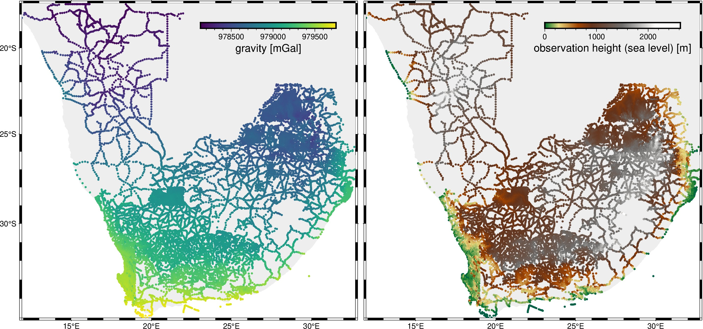

# Southern Africa - Ground-based gravity

This is a public domain compilation of ground measurements of gravity from
Southern Africa.
The observations are the absolute gravity values in mGal.
The horizontal datum is not specified and heights are referenced to "sea
level", which we will interpret as the geoid (which realization is likely not
relevant since the uncertainty in the height is probably larger than geoid
model differences).

| | Summary |
|--:|:--|
| File | `southern-africa-gravity.csv.xz` |
| Size | 0.14 Mb |
| Version | [v1](https://github.com/fatiando-data/southern-africa-gravity/releases/latest) |
| DOI | https://doi.org/10.5281/zenodo.5882430 |
| License | [CC-BY](https://creativecommons.org/licenses/by/4.0/) |
| MD5 | `md5:1dee324a14e647855366d6eb01a1ef35` |
| SHA256 | `sha256:f5f8e5eb6cd97f104fbb739cf389113cbf28ca8ee003043fab720a0fa7262cac` |
| Source | [NOAA NCEI](https://www.ngdc.noaa.gov/mgg/gravity/) |
| Original license | [public domain](https://ngdc.noaa.gov/ngdcinfo/privacy.html) |
| Processing code | [`prepare.ipynb`](https://nbviewer.org/github/fatiando-data/southern-africa-gravity/blob/main/prepare.ipynb) |

## Changes made

> These are the changes made to the original dataset.

* Keep only coordinates, absolute gravity, and the (sea-level) observation
  height.
* Remove some points below sea-level (a bit suspicious and are potentially
  flawed heights from shipborne measurements).
* Convert from a custom text format to compressed CSV.

## About this repository

This is a place to format and prepare the original dataset for use in our
tutorials and documentation.

We include the source code that prepares the datasets for redistribution by
filtering, standardizing, converting coordinates, compressing, etc.
The goal is to make loading the data as easy as possible (e.g., a single call
to `pandas.read_csv` or `xarray.load_dataset`).
Whenever possible, the code also downloads the original data (otherwise the
original data are included in this repository).

> 💡 **Tip:** The easiest way to download this dataset is using
> [Pooch](https://www.fatiando.org/pooch), particularly to download straight
> from the DOI of a release.

## Contributing

See our [Contributing Guidelines][contrib] for information on proposing new
datasets and making changes to this repository.

## License

All Python source code is made available under the BSD 3-clause license. You
can freely use and modify the code, without warranty, so long as you provide
attribution to the authors.

Unless otherwise specified, all data files and figures created by the code are
available under the Creative Commons Attribution 4.0 License (CC-BY).

See [`LICENSE.txt`](LICENSE.txt) for the full text of each license.

The license for the original data is specified in this `README.md` file.

[contrib]: https://github.com/fatiando-data/.github/blob/main/CONTRIBUTING.md
